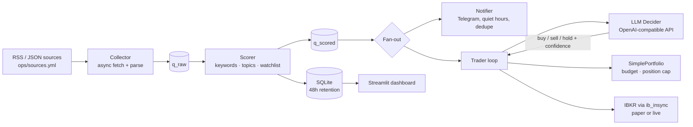

# AI-Based Automated Trading System

News-driven trading agent: ingests financial news, scores relevance, asks an LLM for a trade thesis, and executes orders asynchronously through the Interactive Brokers (IBKR) API, with Telegram alerts carrying the model's reasoning. Personal project, sole developer, Aug–Nov 2025.

**Demo video (3 min):** [Google Drive](https://drive.google.com/file/d/1k3yB0RNYbgavo4jxSAeqxeseEwzIKmFb/view?usp=sharing)

## Results

- End-to-end pipeline runs unattended: 20+ RSS/JSON sources → keyword scoring → LLM decision (JSON: action, symbols, confidence, reason) → IBKR market order → Telegram alert, all as concurrent asyncio tasks.
- Validated against both IBKR paper and live accounts with small live trades; every LLM call is logged with its thesis so decisions can be reviewed against what the market did next.
- Risk controls: score and confidence thresholds, per-symbol position cap, virtual-budget check before each order, event de-duplication, 48-hour retention with automatic cleanup.

No return figures are reported; the goal was a working execution loop, not a backtested strategy.

## Architecture



## Tech stack

Python 3.8+ · asyncio · httpx · feedparser · aiosqlite · ib_insync · python-telegram-bot · Streamlit · DeepSeek / any OpenAI-compatible LLM endpoint

## Run

```bash
pip install -r requirements.txt
cp .env.example .env            # fill in Telegram + LLM credentials
# start IB Gateway or TWS and enable API access (paper port 4002 / 7497)
python -m app.main --run-seconds 0     # pipeline; Ctrl-C to stop
streamlit run app/web.py               # optional dashboard
```

`ops/config.yml` holds thresholds and the IBKR connection; `dry_run: true` (default) logs intended orders without sending them. Set `dry_run: false` and point `port` at a live gateway only after paper testing. Sources, keywords, topics and the symbol watchlist live in `ops/*.yml`.

Tests: `make test` runs the offline suite in `tests/test_all.py`; scripts under `tests/` prefixed `test_ibkr_*` and `test_llm*` need a running gateway or API key.

## Data sources

Public RSS/JSON feeds listed in `ops/sources.yml` (SEC, Federal Reserve, company IR pages, tech and finance news). Feeds are fetched at run time; nothing is redistributed in this repository. Use of each feed is subject to its publisher's terms.

## Disclaimer

Educational project. Not investment advice. Running with `dry_run: false` sends real orders to whatever account the gateway is logged into.
